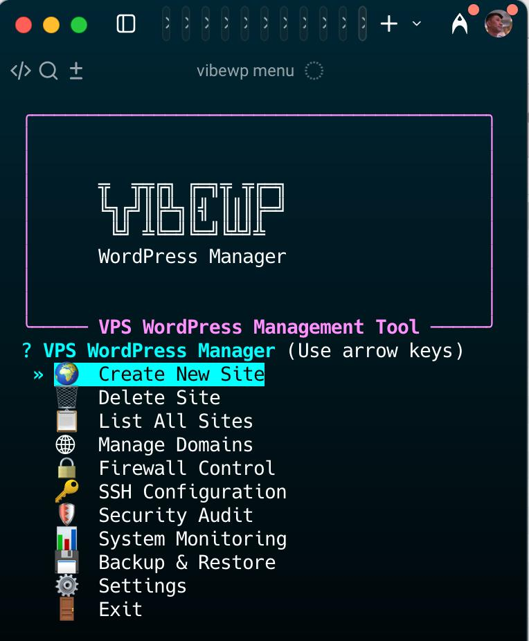

# VibeWP - VPS WordPress Manager

Complete CLI tool for managing WordPress sites on VPS with automatic HTTPS, Docker isolation, and advanced operations.

## ✨ Features

- 🚀 **One-line installation** - Install on fresh Ubuntu VPS in 30 seconds
- 🎯 **< 5 minute deployments** - Create WordPress sites with automatic HTTPS
- 🔄 **Dual engine support** - Choose FrankenWP (speed) or OpenLiteSpeed (stability) per site
- 🔒 **Security-first** - SSH hardening, firewall, fail2ban, automated updates
- 🌐 **Multi-domain** - Add unlimited domains to any site
- 📦 **Complete operations** - Backups, monitoring, security scanning
- 🎨 **Interactive UI** - Beautiful CLI with arrow-key menus

## 🎬 See It In Action

**Interactive Menu Walkthrough**

[](https://youtube.com/shorts/Hg6WdRpeMLc)

*Click to watch: Full menu navigation showing site management, domains, security, backups, and more*

<details>
<summary>📸 Full Menu Screenshot</summary>



</details>

## 🚀 Quick Start

### Prerequisites

**Before installing VibeWP, ensure you have:**

1. **Fresh Ubuntu VPS** (22.04 or 24.04 LTS)
2. **Docker Engine installed and running** (20.10+)
   - VibeWP requires Docker to be pre-installed
   - Install Docker: `curl -fsSL https://get.docker.com | sh`
   - Enable Docker: `systemctl start docker && systemctl enable docker`
3. **Root or sudo access** to the VPS
4. **Domain DNS** pointed to your VPS IP address

### One-Line Install

```bash
curl -fsSL https://raw.githubusercontent.com/vibery-studio/vibewp/main/install.sh | sudo bash
```

**What this installer does:**
- ✅ Installs VibeWP CLI (Python package)
- ✅ Generates SSH keys for localhost Docker access
- ✅ Creates Docker proxy network
- ✅ Deploys Caddy reverse proxy container
- ✅ Initializes configuration files

### Create Your First Site

```bash
vibewp site create
```

**Fully automated WordPress installation!** The command will:
- Deploy WordPress containers (FrankenWP or OpenLiteSpeed)
- Auto-install WordPress via WP-CLI
- Generate secure credentials
- Display admin login details immediately

No manual WordPress setup form required!

## 📋 Requirements

- **OS**: Ubuntu 22.04 or 24.04 LTS
- **RAM**: 2GB minimum
- **CPU**: 2 cores recommended
- **Docker**: 20.10+ with Docker Compose v2
- **Access**: Root or sudo user
- **Domain**: DNS pointed to your VPS IP

## 🎯 Commands

### Site Management
```bash
vibewp site create                      # Create new WordPress site (interactive)
vibewp site list                        # List all sites
vibewp site info <name>                 # Show site details
vibewp site start <name>                # Start site containers
vibewp site stop <name>                 # Stop site containers
vibewp site restart <name>              # Restart site containers
vibewp site delete <name>               # Remove site completely
vibewp site logs <name>                 # View container logs
vibewp site reinstall-core <name>       # Reinstall WordPress core (after hack)
```

### Domain Management
```bash
vibewp domain add <site> <domain>       # Add domain to site
vibewp domain remove <site> <domain>    # Remove domain from site
vibewp domain set-primary <site>        # Change primary domain
vibewp domain list <site>               # List all domains
vibewp domain ssl-status <site>         # Check SSL certificate status
```

### Security & VPS Operations
```bash
# Security Commands
vibewp security scan                    # Basic security scan
vibewp security audit-server            # Full server security audit (includes WPScan)
vibewp security set-wpscan-token <token># Configure WPScan API token
vibewp security clear-wpscan-token      # Remove WPScan API token
vibewp security harden-vps              # Apply VPS security hardening
vibewp security harden-wp <site>        # Apply WordPress security hardening

# Malware Detection & Cleanup
vibewp malware scan <site>              # Scan for malware indicators (non-destructive)
vibewp malware cleanup <site>           # Remove malware (requires confirmation)
  --plugins 'plugin1,plugin2'           # Remove specific plugins
  --files 'file1.php,file2.php'         # Remove specific files
  --auto                                # Auto-remove detected suspicious items
  --backup/--no-backup                  # Create backup first (default: yes)

# Firewall Management
vibewp firewall list                    # List firewall rules
vibewp firewall open <port>             # Open firewall port
vibewp firewall close <port>            # Close firewall port

# SSH Configuration
vibewp ssh change-port <port>           # Change SSH port safely

# System Monitoring
vibewp system status                    # Show resource usage
vibewp doctor check                     # Run system diagnostics
```

### Backup & Recovery
```bash
vibewp backup create <site>                    # Create local backup
vibewp backup create <site> --remote           # Create backup + upload to S3
vibewp backup restore <site> <backup>          # Restore from backup
vibewp backup list <site>                      # List local backups
vibewp backup list-remote [--site <name>]      # List remote S3 backups
vibewp backup configure-remote                 # Setup S3-compatible storage
```

### SFTP Access
```bash
vibewp sftp add-key <site> <pub-key>    # Grant SFTP access
vibewp sftp remove-key <site> <id>      # Revoke SFTP access
vibewp sftp list [site]                 # List SFTP users
vibewp sftp test <site> <id>            # Test SFTP connection
vibewp sftp info                        # Show SFTP configuration
```

### Proxy & PHP Management
```bash
# Proxy Management
vibewp proxy reload                     # Reload Caddy configuration
vibewp proxy status                     # Check proxy status

# PHP Configuration
vibewp php set-limits <site>            # Set PHP limits (upload, memory, post)
  --upload-max 1G                       # Max upload file size
  --memory-limit 1G                     # PHP memory limit
  --post-max 1G                         # Max POST size
vibewp php show-limits <site>           # Show current PHP limits
```

### Self-Update Management
```bash
vibewp update check [--pre]             # Check for new version
vibewp update install [--pre] [--yes]   # Install latest version
vibewp update cleanup [--keep 3]        # Cleanup old backups
vibewp update info                      # Show installation details
vibewp --version                        # Show version & install method
```

### Interactive Menu
```bash
vibewp menu                             # Launch full interactive UI
```

### Configuration
```bash
vibewp config init                      # Initialize configuration
vibewp config show                      # Display current config
vibewp config path                      # Show config file location
```

## 🏗️ Architecture

```
Caddy Reverse Proxy (Auto HTTPS)
    ├── FrankenWP Sites (FrankenPHP + MariaDB)
    └── OpenLiteSpeed Sites (OLS + MariaDB + Redis)
```

**Network Isolation**: Each site runs in isolated Docker network, connected via Caddy proxy.

## 🔒 Security Features

- ✅ SSH key-only authentication
- ✅ Custom SSH port with safe change mechanism
- ✅ UFW firewall with fail2ban
- ✅ Automatic security updates
- ✅ 32-character database passwords
- ✅ Network isolation per site
- ✅ Automatic HTTPS (Let's Encrypt)
- ✅ SFTP access with site-specific restrictions
- ✅ Server security auditing with WPScan integration

## 📦 What Gets Installed

The VibeWP installer sets up:

- **VibeWP CLI** (Python package with all dependencies)
- **Caddy reverse proxy** (Docker container for auto-HTTPS)
- **Docker networks** (isolated networking per site)
- **Configuration files** (`~/.vibewp/`)

**Not included (must be pre-installed):**
- Docker Engine 20.10+ (prerequisite)
- Python 3.10+ (usually pre-installed on Ubuntu)
- UFW firewall (managed via VibeWP commands)
- fail2ban (optional, can be installed via `apt`)

**Optional (auto-installed when needed):**
- rclone (for remote S3 backups, installed via `vibewp backup configure-remote`)

## 🎓 Usage Examples

### Create FrankenWP Site
```bash
vibewp site create \
  --site-name myblog \
  --domain blog.example.com \
  --wp-type frankenwp \
  --admin-email admin@example.com
```

### Create OpenLiteSpeed Site
```bash
vibewp site create \
  --site-name mystore \
  --domain store.example.com \
  --wp-type ols \
  --admin-email admin@example.com
```

### Add Additional Domain
```bash
vibewp domain add myblog www.blog.example.com
```

### Change SSH Port Safely
```bash
vibewp ssh change-port 2222
# Automatic rollback if connection fails
```

### Run Full Server Security Audit
```bash
# Basic audit with console output
vibewp security audit-server

# Save HTML report
vibewp security audit-server --format html --output ~/audit-report.html

# With WPScan vulnerability scanning (API token required)
vibewp security set-wpscan-token YOUR_TOKEN
vibewp security audit-server --format json --output ~/audit.json
```

### Manage SFTP Access

Grant site-specific SFTP access (wp-content only):
```bash
# Add SFTP access
vibewp sftp add-key mysite ~/.ssh/id_rsa.pub --id john

# List SFTP users
vibewp sftp list
vibewp sftp list mysite

# Remove access
vibewp sftp remove-key mysite john

# Test configuration
vibewp sftp test mysite john

# Show detailed info
vibewp sftp info
```

**Client connection** (user sees only /wp-content):
```bash
sftp sftp_mysite_john@your-server.com
```

**Features**:
- SSH key authentication only (no passwords)
- Chroot jail restricted to site's wp-content
- No shell access - SFTP only
- Cannot navigate outside wp-content
- Cannot access other sites

### Setup Remote Backups to S3

Configure S3-compatible storage for automatic backup uploads:

```bash
# Configure remote storage (interactive setup)
vibewp backup configure-remote

# Create backup and upload to S3
vibewp backup create mysite --remote

# List remote backups
vibewp backup list-remote --site mysite
```

**Supported providers**:
- AWS S3 (standard S3)
- Cloudflare R2 (zero egress fees)
- Backblaze B2 (affordable storage)
- Any S3-compatible storage

**Features**:
- Automatic rclone installation and configuration
- Client-side encryption support
- Configurable retention policies
- Automatic cleanup of old backups
- Parallel transfer for speed

## 🔧 Configuration

Config stored in `~/.vibewp/sites.yaml`:

```yaml
vps:
  host: "YOUR_VPS_IP"
  port: 22
  user: "root"
  key_path: "~/.ssh/id_rsa"
  wpscan_api_token: "YOUR_WPSCAN_TOKEN"  # Optional, for vulnerability scanning

sites:
  myblog:
    domain: "blog.example.com"
    type: "frankenwp"
    status: "running"
    created: "2025-11-10T16:00:00Z"
```

**WPScan API Setup** (optional, for vulnerability scanning):
- Get free token: https://wpscan.com/api
- Configure: `vibewp security set-wpscan-token YOUR_TOKEN`
- Free tier: 25 requests/day

## 🐛 Troubleshooting

### Command Not Found
```bash
# Verify installation
which vibewp

# If not found, re-run installer
curl -fsSL https://raw.githubusercontent.com/vibery-studio/vibewp/main/install.sh | sudo bash
```

### Site Won't Start
```bash
# Check container logs
vibewp site logs <site-name>

# Check Docker status
docker ps -a
```

### SSL Certificate Issues
```bash
# Check certificate status
vibewp domain ssl-status <site-name>

# Verify DNS points to VPS
dig +short yourdomain.com
```

## 📊 System Requirements

| Component | Minimum | Recommended |
|-----------|---------|-------------|
| CPU | 1 core | 2 cores |
| RAM | 1GB | 2GB+ |
| Disk | 10GB | 20GB+ |
| Sites | 1-2 | 3-5 |

## 🤝 Contributing

Contributions welcome! Please:

1. Fork the repository
2. Create feature branch
3. Test on Ubuntu 22.04 or 24.04
4. Submit pull request

## 📄 License

MIT License - See LICENSE file

## 🆘 Support

- **Issues**: https://github.com/vibery-studio/vibewp/issues
- **Docs**: https://github.com/vibery-studio/vibewp/wiki
- **Discord**: Coming soon

## 🔧 Under the Hood

VibeWP leverages cutting-edge containerization and web server technologies:

### Core Technologies

**Container Infrastructure**
- 🐳 **Docker** - Isolated environments per WordPress site
- 🔌 **Docker Compose v2** - Orchestration and networking
- 🌐 **Caddy v2** - Reverse proxy with automatic HTTPS (Let's Encrypt)

**WordPress Engines (Choose per site)**

**FrankenWP** (Speed-optimized)
- ⚡ **FrankenPHP** - WordPress running on native Go PHP SAPI
- 📦 **Early Hints** - HTTP 103 for faster page loads
- 🔥 **Worker Mode** - Keep WordPress in memory between requests
- 🗄️ **MariaDB 11** - High-performance database

**OpenLiteSpeed** (Enterprise-grade)
- 🚀 **OpenLiteSpeed** - LiteSpeed's open-source web server
- ⚡ **LSCache** - Built-in full-page caching + object cache
- 🔴 **Redis** - Session and object caching
- 🗄️ **MariaDB 11** - Optimized for OLS
- 🎯 **PHP 8.3** - Latest PHP with JIT compiler

### Network Architecture

```
Internet
    ↓
Caddy Reverse Proxy (Port 80/443)
    ├── Auto HTTPS/SSL via Let's Encrypt
    ├── HTTP/2 & HTTP/3 support
    └── Routes to isolated networks
         ├── site1_network → FrankenWP + MariaDB
         ├── site2_network → OLS + Redis + MariaDB
         └── site3_network → ...
```

**Security Layers**
- 🔐 Network isolation per site
- 🔥 UFW firewall integration
- 🛡️ fail2ban protection
- 🔑 SSH key-only authentication
- 📁 Chroot SFTP jails (wp-content only)

## 🎯 Roadmap

### Completed ✅
- [x] Self-update system with rollback
- [x] SFTP access management
- [x] Security auditing (server + WordPress)
- [x] PHP version switching
- [x] System diagnostics (doctor command)
- [x] Remote backups to S3-compatible storage (rclone)

### Planned 🚧
- [ ] VPS security hardening automation
- [ ] WordPress security hardening
- [ ] Multi-VPS management
- [ ] Site cloning
- [ ] Automated scheduled backups
- [ ] Monitoring dashboard
- [ ] Email notifications
- [ ] CDN integration

## ⭐ Star History

If VibeWP helps you, please star the repo!

---

**Built with ❤️ by Vibery Studio**
